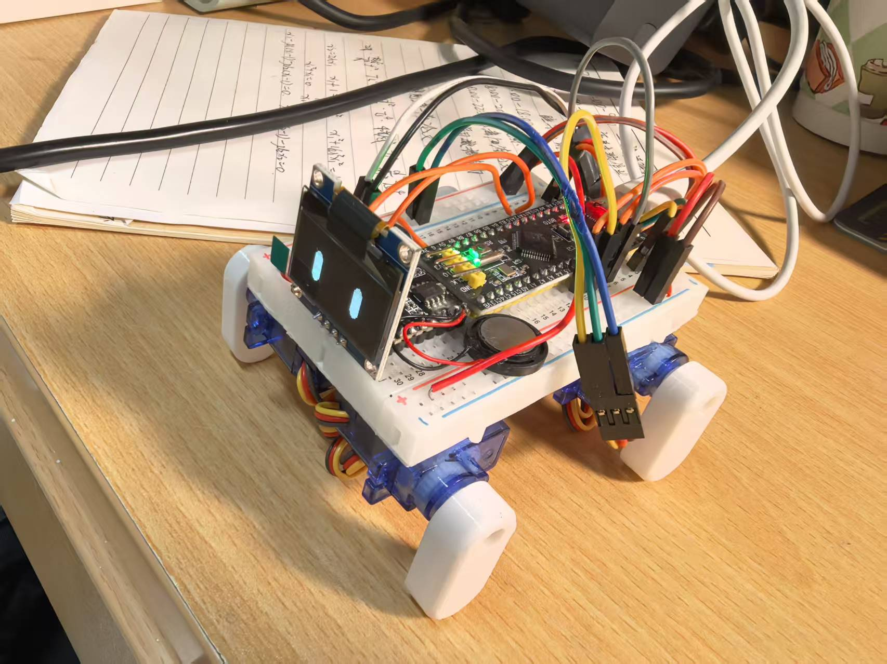
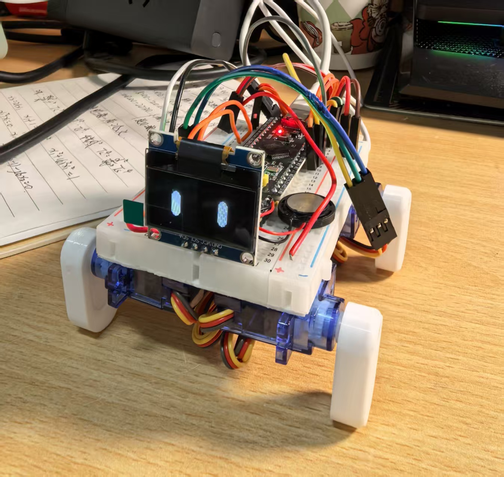
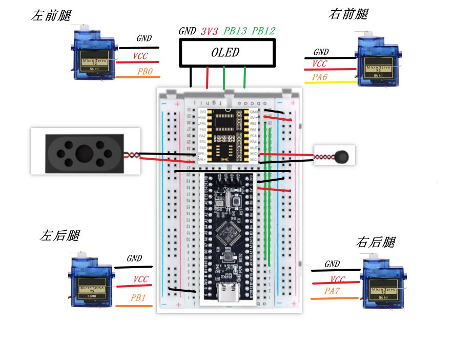

# 声控智能小狗大作业报告

**课程名称**：电子电路实验  
**报告日期**：2026年1月2日  
**提交人**：  

---

## 一、组内成员及分工

---

## 二、作品实物图

  
  
> *图1/2：声控智能小狗实物照片（含麦克风、主控板、舵机、电源模块）*


---

## 三、设计思路

本项目旨在设计一款可通过语音指令控制的仿生智能小狗，具备基础交互与动作响应能力。整体设计分为 **感知层**、**控制层** 与 **执行层**：

- **感知层**：使采用 **ASR-PRO 模块**（内置高性能离线语音识别引擎），通过天问Block完成唤醒词“小智”和16条命令词的训练与部署；
- **控制层**：以 **STM32F103C8T6（ARM Cortex-M3）** 作为主控单元，接收语音模块指令并解析，控制舵机动作。
- **执行层**：采用 **4路舵机（SG90）** 模拟小狗四肢运动，通过预设动作序列完成“前进”“跳舞”“坐下”等复杂行为。

系统工作流程如下：  
1. 语音模块持续监听环境声音；  
2. 检测到唤醒词“小智”后进入指令接收模式；  
3. 用户说出互动词（如“前进”“跳舞”等），语音模块识别后通过串口发送指令码；  
4. STM32解析指令码，调用对应动作函数，驱动舵机完成动作。

---

## 四、电路原理简要分析

### 4.1 系统总体框图

```
[麦克风] → [ASR-PRO语音识别模块] 
                     ↓ (UART@9600bps)
       [主控/舵机驱动板（如STM32 + PCA9685）]
                     ↓ (PWM信号)
            [8路舵机（模拟四肢、头、尾）]
                     ↑
       [TypeC → AMS1117-5V（舵机） / 3.3V（ASR-PRO）]
```

### 4.2 关键模块说明

- **ASR-PRO 语音识别模块**  
  - 支持离线中文语音识别；
  - 内置高灵敏度麦克风与音频处理电路；
  - 通过 天问Block 图形化界面完成唤醒词与命令词的录制、训练与绑定；
  - 每条指令可绑定一个 串口输出编号（0~255）；
  - 支持识别成功后自动发送指令码，无需额外编程。

- **STM32F103C8T6 主控**  
  - 接收UART数据，使用中断方式处理；
  - 通过 I2C 控制 PCA9685 舵机驱动板；
  - 实现动作状态机管理。

- **PCA9685 舵机驱动**  
  - 12位PWM分辨率，支持16路舵机（本项目使用8路）；
  - I2C地址可配置，避免冲突。

- **电源系统**  
  - Type C 充电插头直接给主控供电

---

## 五、各关键点的波形

> *注：弱电实验未接示波器。以下仅为理论波形*

### 5.1 语音模块 UART 输出波形（指令“前进”）

```
通道：RX（STM32接收端）
波特率：9600
数据帧：0x01（代表“前进”）
波形特征：起始位(0) + 8位数据(00000001) + 停止位(1)
```


### 5.2 PCA9685 PWM 信号（舵机角度90°）

```
频率：50Hz（周期20ms）
高电平时间：1.5ms → 对应90°中位
```

---

## 六、调试中遇到的问题及解决方法

| 问题描述 | 原因分析 | 解决方案 |
|--------|--------|--------|
| **语音识别率低，尤其在嘈杂环境** | ASR-PRO 对背景噪声敏感；默认阈值过高 | 1. 在安静环境重新训练指令词；<br>2. 调整识别灵敏度寄存器（0x1C）；<br>3. 增加麦克风前置放大电路电容滤波 |
| **舵机抖动、动作不连贯** | 接线接触不严、麦克风模块断路 | 重新接线焊接 |

---

## 七、总结

本项目成功实现了基于离线语音识别的智能仿生小狗，支持16种语音指令响应。通过模块化设计，系统具备良好的可扩展性（未来可加入红外避障、蓝牙遥控等功能）。项目锻炼了团队在嵌入式硬件、语音处理、机械控制与系统集成方面的综合能力。

---

**附录**：  
- 代码仓库：`https://github.com/bolt2012-china/CleverVoiceControlDog`  
- 电路原理图：  
- 天问block语音控制代码：
